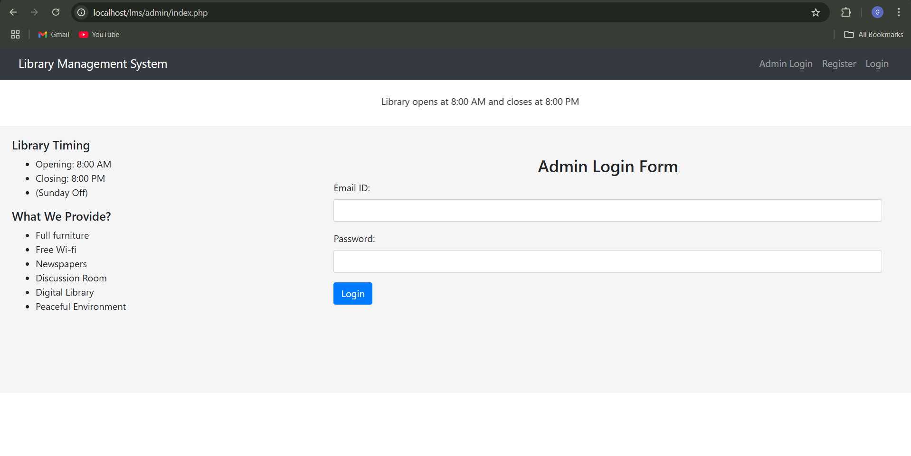
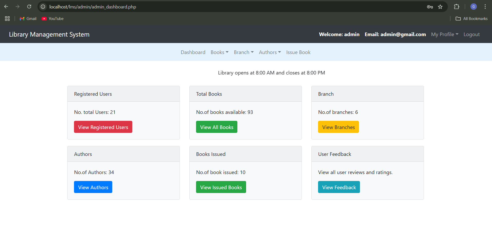
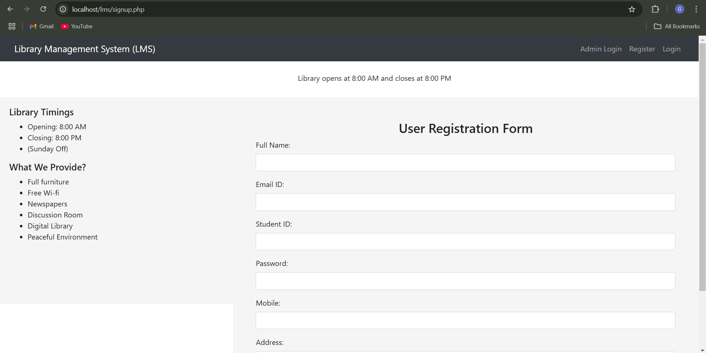
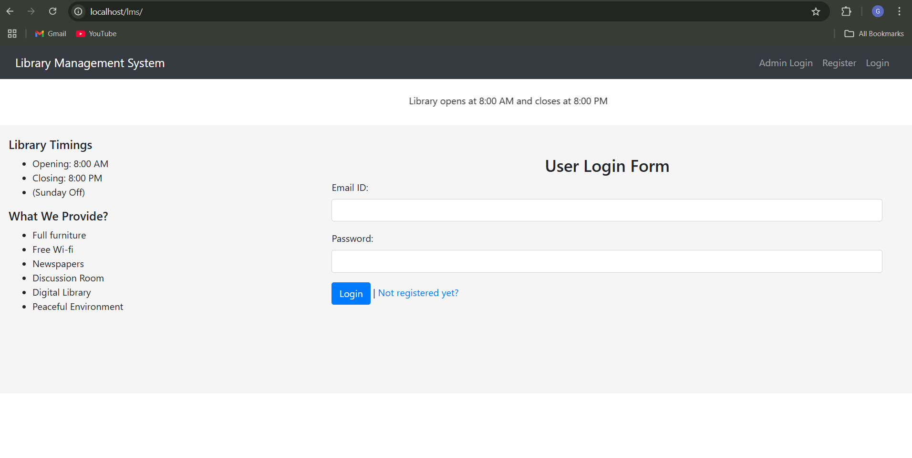
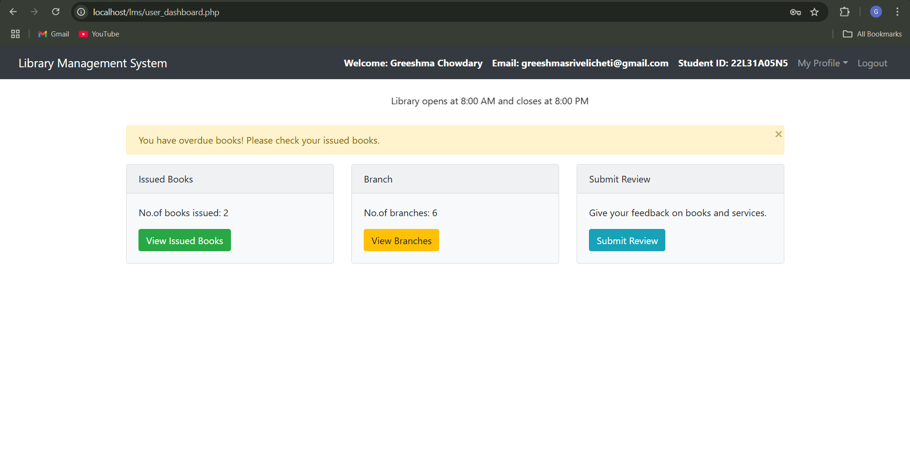

# 📚 Library Management System (LMS)

A **Library Management System** built with **PHP** and **MySQL**, designed to help libraries manage books, users, and borrowing records. This project is developed using **XAMPP** as the local development server.

## 🚀 Features
✔ User Registration & Login  
✔ Admin Dashboard to Manage Books, Users & Categories  
✔ Issue & Return Books  
✔ Book Search & Filtering  
✔ User Profile Management  
✔ Secure Authentication System  

## 📂 Installation Guide  

### 🖥️ 1️⃣ Downloading the Project  

#### 🔹 **Method 1: Download as ZIP (Recommended for Beginners)**  
1. Go to the **GitHub Repository**:  
   👉 [Library Management System](https://github.com/Greeshma2005/Library-Management-System)  
2. Click the **Code** button (Green button).  
3. Click **Download ZIP**.  
4. Extract the ZIP file and **move the extracted folder** to:  
   👉 C:\xampp\htdocs\LMS

#### 🔹 **Method 2: Clone via Git (For Developers)**  
1. Open **Git Bash / Command Prompt / Terminal**.  
2. Navigate to `htdocs` inside XAMPP:  
    👉 cd C:\xampp\htdocs
3. Clone the repository:
    👉 git clone https://github.com/Greeshma2005/Library-Management-System.git
4. Navigate to the project folder:
    👉 cd LMS

   
## 2️⃣ Database Configuration
1. Open **XAMPP Control Panel** and start:
   🔹Apache (for PHP)
   🔹MySQL (for Database)
2. Open your browser and go to:
    👉 http://localhost/phpmyadmin/
3. Create a new database((e.g., lms)
4. Import the SQL file:
   🔹 Click Import → Select lms.sql from the project folder → Click Go.

## 🌐 3️⃣ Running the Project (Localhost)
1. Open your browser and enter:
   http://localhost/lms
2. The login page should appear. Use the default credentials (if any) or register a new account.

## ⚙ Default Admin Credentials (if applicable)
Username: admin
E-mail: admin@gmail.com
Password: admin@1234

## 📸 Screenshot
Here is a screenshot of the Admin Login page:

Here is a screenshot of the Admin Dashboard page:

Here is a screenshot of the User Registration page:

Here is a screenshot of the User Login page:

Here is a screenshot of the User Dashboard page:

## 📢 Contributing
Feel free to fork this repository, make improvements, and submit pull requests.

## 📜 License
This project is for educational purposes. Feel free to modify and enhance it. 🚀
